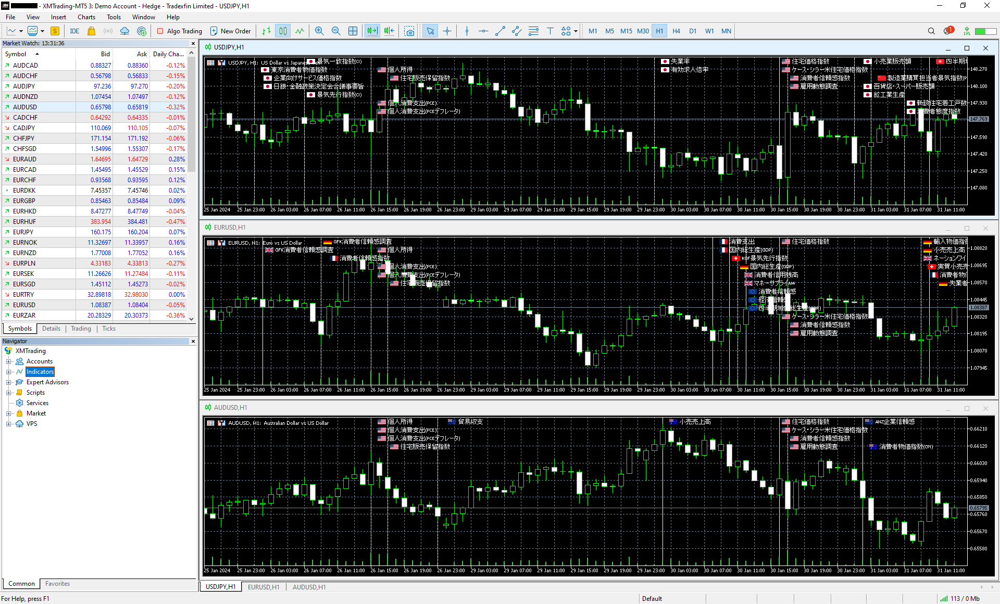

# EconomicIndicators
## 概要

MT5のチャート画面に経済指標等のスケジュールを表示するインジケータです。

## 使用方法
1. ReleasesからEconomicIndicators.zipをダウンロードします。
1. zipファイルの内容をMT5のデータフォルダにコピーします。  
1. 経済指標一覧を格納したcsvファイルを以下のフォルダに格納します。  
    （データフォルダ）\MQL5\Files\EconomicIndicators
1. MT5を起動します。
1. NavigatorウィンドウのIndicatorsツリーからEconomicIndicatorsをチャートに貼り付けます。  

## 必要なもの
- 本ツールの利用にはMT5が必要です。各証券会社がHPで配布しています。本ツールはどの証券会社のMT5でも動作します。

## csvファイルのフォーマット
    日付時刻,国名,重要度,説明
<table>
  <tr>
    <th>Parameter names</th>
    <th>Details</th>
  </tr>
  <tr>
    <td>日付時刻</td>
    <td>経済指標が発表される日付と時刻をYYYY-MM-DD HH:mm形式で指定します。タイムゾーンはローカル時刻です。</td>
  </tr>
  <tr>
    <td>国名</td>
    <td>対象国（対象グループ）を指定します。対応しているのは以下の通りです。
      <ul>
        <li>Argentine</li>
        <li>ASEAN</li>
        <li>AU</li>
        <li>Australia</li>
        <li>Brazil</li>
        <li>Canada</li>
        <li>China</li>
        <li>Czech</li>
        <li>Denmark</li>
        <li>EU</li>
        <li>France</li>
        <li>Germany</li>
        <li>Hong Kong</li>
        <li>Hungary</li>
        <li>India</li>
        <li>Indonesia</li>
        <li>Israel</li>
        <li>Italy</li>
        <li>Japan</li>
        <li>Malaysia</li>
        <li>Mexico</li>
        <li>New Zealand</li>
        <li>Norway</li>
        <li>Philippines</li>
        <li>Poland</li>
        <li>Romania</li>
        <li>Russia</li>
        <li>Saudi Arabia</li>
        <li>Singapore</li>
        <li>South Africa</li>
        <li>South Korea</li>
        <li>Spain</li>
        <li>Sweden</li>
        <li>Switzerland</li>
        <li>Taiwan</li>
        <li>Thailand</li>
        <li>Turkey</li>
        <li>UK</li>
        <li>United ArabEmirates</li>
        <li>USA</li>
        <li>Vietnam</li>
      </ul>
    </td>
  </tr>
  <tr>
    <td>重要度（未対応）</td>
    <td>未対応です。この経済指標の重要度を指定します。
      <ul>
        <li>1 通常の経済指標</li>
        <li>2 重要な経済指標</li>
        <li>3 極めて重要な経済指標</li>
      </ul>
    現バージョンでは重要度に応じて線の色を変えたり等の処理はしていません。将来的には対応するかもしれませんが、画面がチカチカしたり音が出たりするのは好きではないので対応しないかもしれません（←作者の個人的な好み）。
    </td>
  </tr>
  <tr>
    <td>説明</td>
    <td>この経済指標の説明を記述します。</td>
  </tr>
</table>

## 補足
- csvファイルは各自で用意してください。外部のサイトから自動取得する処理は実装されていません。
- 上記フォルダにあるcsvファイルは全て読み込まれます。項目を古い順/新しい順に並び替える必要はありません（内部的にソートされます）。
- csvファイルの全ての項目が表示対象となるわけではありません。表示対象となるのは次の条件を満たすものです。
  - 取引通貨または決済通貨と同じ地域、かつ、
  - 読み込まれたcsvファイルの先頭1000件
- csvファイルを格納したフォルダは30分おきに再ロードされます。
- MT4では動作しません。コンパイルも通りません。
